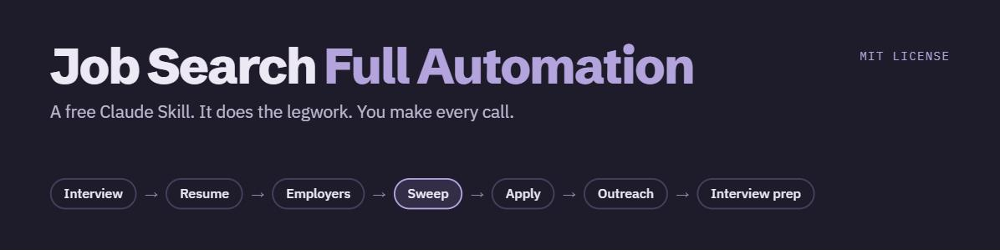
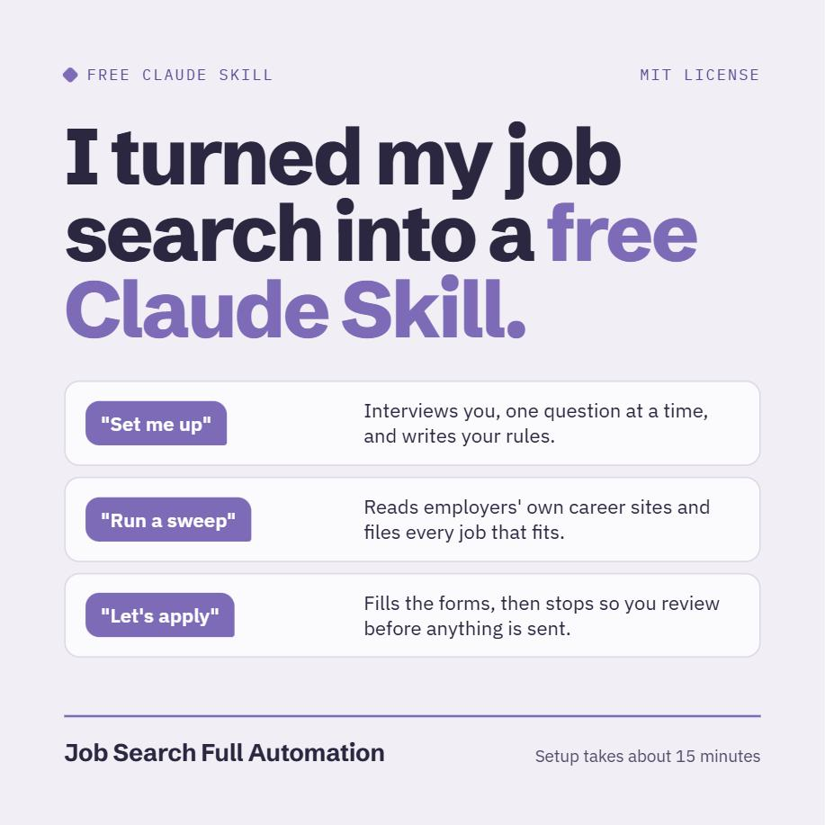
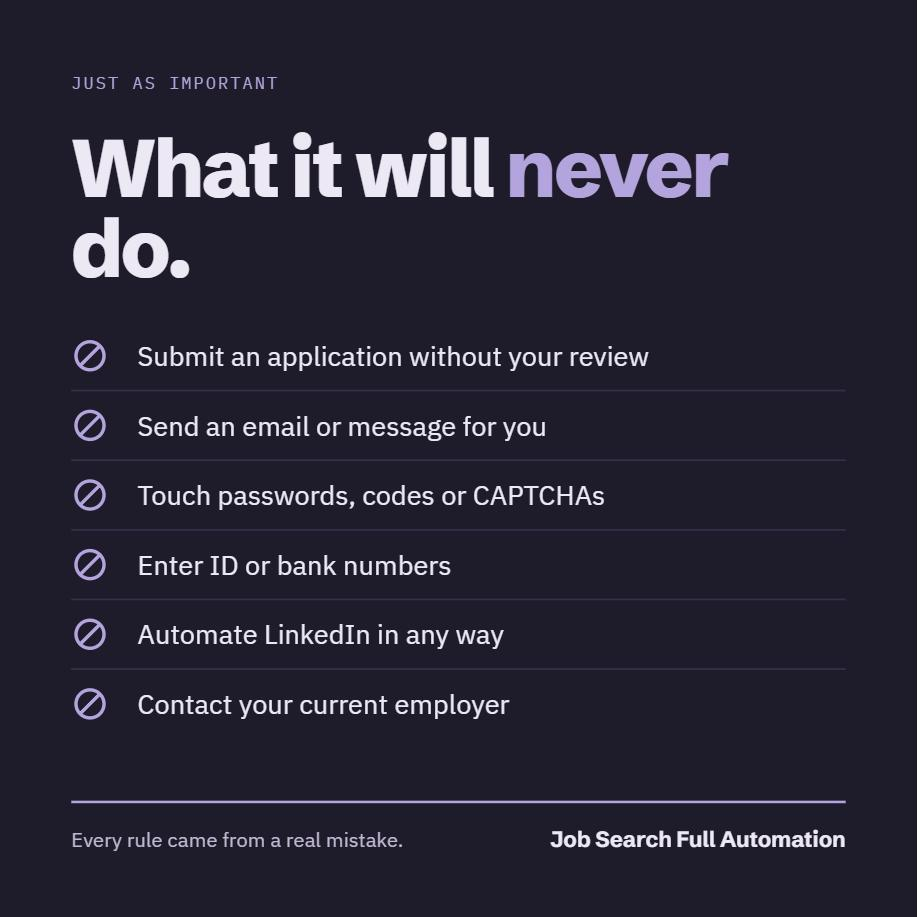
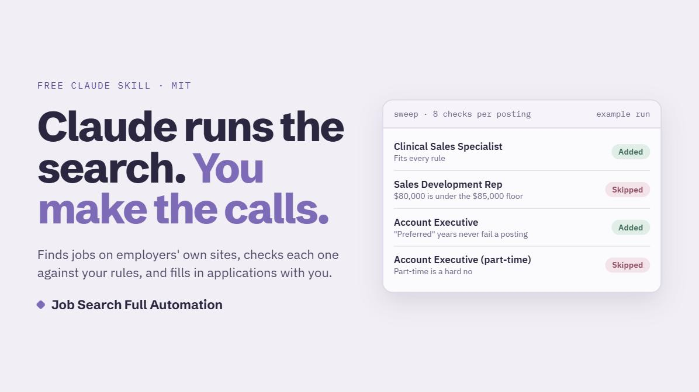

# Job Search Full Automation

A free set of instructions (a "Skill") that turns Claude (and only Claude) into a job search assistant. It finds openings on employers' own career sites, checks each one against your rules, keeps a tracker up to date, fills in applications with you, drafts outreach for you to send, and prepares you for interviews.

**It automates the research, the tracking and the form-filling. You stay in charge of every submission and every message.**

**See it in action:** [a guided walkthrough](https://claude.ai/artifact/XEFBtevswxWhwLyfWV2gfD) follows a made-up user from the first interview to an interview prep file. It works on a phone; tap Play on any step.

This was built for one real job search and used every day on it. This public version has none of that person's data in it. Everything personal comes from a short interview Claude runs with you the first time.

---

## What it does

| You say | Claude does |
|---|---|
| "Set me up" | Interviews you one question at a time about the jobs you want, where, pay, industries and your hard noes. Shows you your rules and saves them only when you approve. |
| "Build my resume" | Asks about your work one question at a time, writes down only facts you confirm, looks at a few real postings for the job you want so your resume puts first what those employers ask for, and builds a clean resume. Works for any job in any field. You approve the facts, each section and the final PDF. Already happy with your resume? Skip it. |
| "Suggest employers that fit my background" | Searches local and industry lists for employers that fit your rules, checks each one has its own careers site, and adds only the ones you approve. |
| "Tell me about [company]" | A short, sourced brief on one employer. It can also map an industry near you, or research what a job title does and pays (from employers' own posted pay). |
| "Add these employers: ..." | Finds each employer's own careers page and adds it to your target list. |
| "Run a sweep" | Reads your employers' career sites, adds postings that fit your rules to your tracker, and records why the others did not fit. Rechecks that open listings are still up. |
| "Let's apply" | Opens each listing, fills in the form from your answer bank and resume, and stops for your review before anything is submitted. |
| "Run outreach" | Finds the likely hiring manager from public sources and drafts a short note. You decide whether to send it. |
| "Prep me for my interview with ..." | Writes a prep file: company brief with sources, likely questions, your true stories that answer them, and questions to ask. |
| "Check my email" | Reads your inbox (if you have an email connector), finds employer replies, and suggests status updates. Changes nothing until you say yes. |

  
  

## What it will not do

- **Submit an application without your review.** Auto-submit is off. You can turn it on for one session by writing "I turn on auto-submit for this session". It turns off when the session ends.
- **Send any message.** Outreach is drafts only. You send everything yourself.
- **Handle passwords or accounts.** It never creates accounts, types passwords, reads password fields or enters one-time codes. When a site needs those, it hands the browser to you.
- **Enter ID or bank numbers.** No Social Security, driver's license, bank or card numbers, ever.
- **Get past CAPTCHAs or bot checks.** If a site blocks it, it marks the site for you to check by hand.
- **Touch LinkedIn.** See "Site terms" below.
- **Contact your current employer**, or use your work email, phone or accounts.
- **Make things up.** Your resume is built only from facts you confirm, and a script checks every number, job and skill against them.
- **Run on its own.** You start every session. Nothing runs on a schedule.

## What you need

1. **A Claude account** on a paid plan, using the **Claude desktop app**. Cowork is the easiest way to run it. Claude Code works too. This project works with Claude only (see "Built for Claude").
2. **Claude in Chrome** (the Claude browser extension for Google Chrome), connected to the Claude app. Sweeps can use the app's built-in browser, but **applying works best with Claude in Chrome**, because the built-in browser cannot upload files such as your resume.
3. **This folder**, downloaded to your computer. It becomes your job search folder.
4. **Your resume** as a PDF.
5. **Python 3, with two add-ons (openpyxl and reportlab).** Claude runs small scripts to check its own work and to build your resume as a PDF.
   - **Claude Code on your own computer:** install Python 3 from python.org (on Windows, tick "Add python.exe to PATH" in the installer). Then open a terminal in your job search folder and run `python -m pip install -r requirements.txt` once.
   - **Cowork:** Claude runs the scripts in its own workspace. If it says Python or an add-on is missing, ask it to install them.
   - Without Python, Claude cannot finish a stage's checks. It will tell you so, and the stage will not be marked done.
6. *Optional:* an email connector (Gmail or Outlook) in Claude, for the mailbox check.

---

## Setup (about 15 minutes)

### Step 1. Download this folder

Download it here: **[job-search-full-automation-main.zip](https://github.com/trotics/job-search-full-automation/archive/refs/heads/main.zip)**. (Or, on [the GitHub page](https://github.com/trotics/job-search-full-automation), click **Code**, then **Download ZIP**.) Unzip it somewhere easy to find, for example your Documents folder. It unzips to a folder called `job-search-full-automation-main`; you can rename it. This folder is now your **job search folder**.

### Step 2. Add the Skill to Claude

**In the Claude app (chat or Cowork):**

1. Open **Customize**, then **Skills**.
2. Click **+**, then **Upload a skill**.
3. Choose `job-search-skill.zip` from your job search folder.
4. Make sure the new **job-search** skill is switched on.

**In Claude Code:** copy the folder `skill/job-search` into `.claude/skills/` in your home folder, so you end up with `.claude/skills/job-search/SKILL.md`.

### Step 3. Give Claude your folder

- **Cowork:** start a new task and choose your job search folder as the folder Claude works in.
- **Claude Code:** open your job search folder as the project.

Put your resume in the `my-files` folder and name it `resume.pdf`.

### Step 4. Set up your tracker

The tracker is where everything lives: your target employers, every listing, its status, its history, and your answer bank.

**Option A: artifact tracker (recommended).** A private web page in your Claude account with its own small database. You see your whole search at a glance, change statuses with one click, and type your own notes.

1. Ask Claude: **"Publish tracker/tracker-page.html as a new artifact with the db capability, and give me the link."**
2. Open the link. You should see an empty tracker that says "No listings recorded yet". The database starts empty. Nothing from anyone else's search is in it.
3. Keep the link. The intake interview (Step 5) asks for it.

Your tracker is private to you. Anyone you share the link with can see your search, so think before sharing. If Claude says it cannot publish an artifact with a database on your plan, use Option B.

**Option B: spreadsheet tracker.** Copy `tracker/spreadsheet/job-search-tracker.xlsx` into your `my-files` folder. Claude reads and writes it during sessions. You can open it in Excel to read it and type in the `yourNotes` column. **Close it in Excel before each session**, because Claude cannot safely save it while you have it open. The `.csv` files in the same folder have the same tabs, for anyone who wants to import them into another program.

Both trackers use the same columns, described in plain words in `skill/job-search/references/tracker-columns.md`.

### Step 5. Your first session

Say: **"Set me up for my job search."**

Claude runs the intake interview: about 30 short questions, one at a time. When you finish, it shows you your rules in full. Change anything you like, then say **approve**. Only then are they saved to `my-files/my-rules.md`. Claude then saves your tracker settings and offers to start your answer bank (the answers you give on most forms).

Then it asks about your resume. Pick one:
- **"Use mine as it is"**: put it in `my-files/resume.pdf`. Claude will not change it.
- **"Improve mine"** or **"I need a new one"**: Claude asks about each job, one question at a time, and builds your resume from the facts you confirm (about 20 to 40 minutes). You can also skip this and say "build my resume" later.

Last, it asks whether you already have a list of employers, and offers to find some.

### Step 6. Your first sweep

1. Say: **"Suggest employers that fit my background."** Claude works from your rules and resume, says why each one fits, and finds its own careers site. Add any you already know: **"Also add these employers: ..."**. You approve the list before it is saved.
2. Say: **"Run a sweep."**

Claude reads each employer's own career site, adds listings that fit to your tracker, and saves a short report in `reports/`. Then say **"Let's apply"** when you have time to sit with it.

---

## Where it runs

| | Claude desktop app (Cowork or Claude Code) on Windows or Mac | Claude on the web (claude.ai in a browser, including Safari on an iPad) | Claude iPhone and iPad app |
|---|---|---|---|
| Intake, resume, company research, interview prep, outreach drafts | Yes, tested | Should work: Skills run in Claude on the web. Not tested yet | Not confirmed |
| Fit call on a posting link you paste | Yes | Should work. Not tested yet | Not confirmed |
| Mailbox check | Yes, with an email connector | Not tested | Not confirmed |
| Sweeps of career sites | Yes | Partly at best: many career sites need a browser Claude can control | No |
| Applying (filling forms, uploading your resume) | Yes, with Claude in Chrome | No | No |
| Your job search folder (rules, resume, reports) | Yes | No folder: keep your files in a Claude Project and save what Claude gives you | No folder |

Claude in Chrome runs only on a desktop computer. Anthropic says it is not supported on mobile devices. On a tablet, use Claude on the web in the browser rather than the app, and expect to do the sweeps and applications from a computer.

## Built for Claude

This project is built and tested for Claude only. The tracker page, the browser automation and the database tool all depend on Claude features, so they will not work in other AI tools.

The instructions themselves are plain text files. If you want to try another AI tool, you can, but you are on your own:

- Use the spreadsheet tracker, not the artifact tracker.
- Expect to do the applications yourself. Most other AI tools cannot control a browser or upload your resume.
- Nothing has been tested outside Claude, so check the tool's work closely.

## Everyday use

- **"Run a sweep"**: weekly is a good pace.
- **"Let's apply"**: Claude works through your To apply listings, highest priority first, in Claude in Chrome. It uploads your resume itself, checks anything the site filled in from it, and stops for your review before anything is submitted. If no upload method works, it tells you what it tried and asks you to attach the file.
- **"Check my email"**: after you have applied to a few places.
- **"Prep me for my interview with [company] on [day]"**: the prep file is saved in `reports/`.
- **"Change my rules"**: reruns only the parts of the interview you want to change.
- **Changing statuses or notes yourself:** you can change a status or type in Your notes on the tracker page any time. A status change adds a dated line to that listing's history. Avoid doing either while Claude is in the middle of a session; do it before or after. If you do, the session's check will say so, and Claude will tell you rather than touch your change.
- **"Suggest employers that fit my background"**, **"Tell me about [company]"**, **"Build my resume"**: see `skill/job-search/references/prompts.md` for the full list of things you can say.

## Safety notes

- **Human review before any submission.** Auto-submit is off by default and lasts one session when you turn it on in writing.
- **Your accounts are yours.** Claude never creates accounts, types or reads passwords, enters codes, or solves CAPTCHAs.
- **No ID or bank numbers**, anywhere: not in forms, not in your tracker, not in your answer bank.
- **Drafts only.** Claude never sends an email, message or connection request.
- **Legal text is shown to you.** Before you agree to arbitration, waivers, non-competes or permission to contact past employers, Claude quotes the text to you.
- **Your notes are yours.** Claude never writes your `yourNotes` column, and only adds to the history log, never rewriting it.
- **Checked by script.** After every session that writes, `tools/check_tracker.py` compares the tracker before and after. It fails if any of these rules was broken.

## Site terms

LinkedIn and some job boards prohibit automated access in their terms of use. **This system does not automate LinkedIn in any way.** It does not scrape it, visit profiles, send messages or open LinkedIn pages. Sweeps read employers' own career sites. Job aggregators are used only as leads, never as proof that a job exists or has closed. **You are responsible for following each site's terms.**

## Your privacy

Everything personal stays in your job search folder (`my-files/`, `reports/`, `backups/`) and your own tracker. Git ignores those folders, so if you ever put your copy of this project on GitHub, your files stay off it.

---

## What is in this folder

| Path | What it is |
|---|---|
| `job-search-skill.zip` | The Skill, ready to upload to the Claude app. |
| `skill/job-search/` | The same Skill as plain files: the map (`SKILL.md`), the rules, nine stages (00 to 08) and references. |
| `skill/job-search-single-file/SKILL.md` | The whole Skill as one file, built from the folder above. |
| `tracker/tracker-page.html` | The artifact tracker page. |
| `tracker/spreadsheet/` | The spreadsheet tracker (`.xlsx`) and matching `.csv` files. |
| `my-files/`, `reports/`, `backups/` | Your files. Ignored by git. |
| `requirements.txt` | The two Python add-ons the scripts need. |
| `docs/images/` | The pictures in this README. |
| `tools/` | Small scripts Claude uses: tracker checks, safe spreadsheet writes, and builds. |
| `tests/`, `examples/test-run/` | A full test with a made-up user, including a resume built by stage 07. See `examples/test-run/test-results.md`. |

## For people changing the code

You need Python 3, openpyxl and reportlab (`python -m pip install -r requirements.txt`).

- Edit the Skill in `skill/job-search/`, then rebuild the ZIP and the single file:
  `python tools/build_skill_zip.py` and `python tools/build_single_file.py`.
- Test the tracker page without publishing it: `python tests/build_local_test.py tests/sample-data/tracker-after-fit.json`, serve the folder with `python -m http.server 8791`, and open `http://localhost:8791/tests/build/tracker-test.html`. It runs against a stand-in database (`tests/stand-in-db.js`).
- Prove the tracker checker still catches rule breaks: `python tests/run_checker_selftest.py`.
- Prove the resume checker still catches made-up facts: `python tests/run_resume_selftest.py`.
- Before sharing your copy: `python tools/check_repo.py --banned PATH`. It checks every file git would share, the inside of the ZIP and spreadsheet, and the git history for your own private details, and for em dashes and en dashes.

### Sharing your own copy safely

If you change this project and put your version online, your name, phone, email or employers can slip into an example or a test without you noticing. Before you share it:

1. Make a plain text file **outside** the project folder (or in `my-files/`, which git never uploads), for example `private-strings.txt`.
2. Put one private detail per line: your name, email, phone, street, employers, and anything else that must never be public.
3. Run `python tools/check_repo.py --banned path/to/private-strings.txt`.

The check fails if any of those details appear anywhere in your copy, including old commits. The list itself never goes into the project.

## License

MIT. See `LICENSE`.
